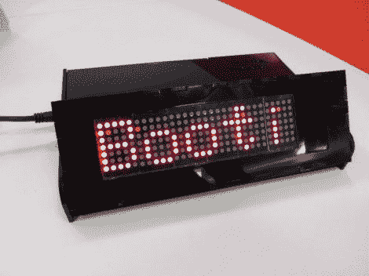

# BeagleBone 为这个联网的 LED 字幕供电

> 原文：<https://hackaday.com/2012/11/01/beaglebone-powers-this-networked-led-marquee/>

[Mahmut]称这个项目为智能盒子。这是一个可以从互联网上下载信息的狗骨控制的 led 字幕。

该项目始于显示器本身。[Mahmut]使用六个 5×7 的 LED 模块来填充他自己生产的电路板。模块的低端由一些 MBI5026 恒流驱动器控制，高端为 PNP 晶体管。显示器使用几个 IDC 带状电缆连接器连接到 BeagleBone 臂板。有了它，他开始着手建造围墙。展示板是在 Google SketchUp 中建模的，以确保机箱设计能够恰当地适合它。激光切割亚克力表壳分为两部分，底部装有驱动电子设备，带有一个铰链部分，用于调整灯罩的角度。

到目前为止，有一些不同的连接功能，在休息后的剪辑中展示出来。BeagleBone 能够下拉 Twitter feeds，通知收到的电子邮件，并滚动消息。

[https://www.youtube.com/embed/-TNj8_MtVdI?version=3&rel=1&showsearch=0&showinfo=1&iv_load_policy=1&fs=1&hl=en-US&autohide=2&wmode=transparent](https://www.youtube.com/embed/-TNj8_MtVdI?version=3&rel=1&showsearch=0&showinfo=1&iv_load_policy=1&fs=1&hl=en-US&autohide=2&wmode=transparent)