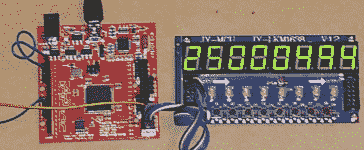

# 构建 100 MHz 频率计数器

> 原文：<https://hackaday.com/2012/11/02/building-a-100-mhz-frequency-counter/>

使用 gates 构建的最大好处是，通过直接使用硬件(而不是使用简单的微控制器)可以获得惊人的速度。[这个 100 MHz 频率计数器](http://hamsterworks.co.nz/mediawiki/index.php/Frequency_counter)就是一个很好的例子。[迈克尔]刚刚用一个凤蝶板做好。

当然，我们不是在这里谈论谨慎的芯片。Papilio 是一个 FPGA 开发板，这意味着他正在用硬件门进行构建，但这仍然是通过编写代码来完成的。上图中，该装置正在测量第二块 FPGA 板产生的 25 MHz 信号。使用 Papilio 的板载 32 MHz 时钟，该设备能够计数高达 100 MHz 的频率。休息后，您可以在视频中看到它正在测量 96.875 MHz 的信号。关于这个片段的一个有趣的事情是，在快结束的时候，他用手指触摸水晶的外壳，赫兹真的跳了一下。

如果 8 位数的显示看起来很熟悉，那是因为[Michael]最近发布了一个库，可以和 FPG 一起使用

[https://www.youtube.com/embed/eCEi2-8Vn_I?version=3&rel=1&showsearch=0&showinfo=1&iv_load_policy=1&fs=1&hl=en-US&autohide=2&wmode=transparent](https://www.youtube.com/embed/eCEi2-8Vn_I?version=3&rel=1&showsearch=0&showinfo=1&iv_load_policy=1&fs=1&hl=en-US&autohide=2&wmode=transparent)