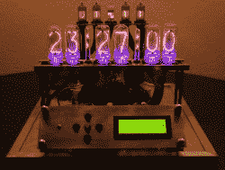
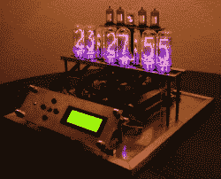
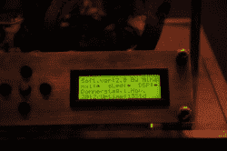
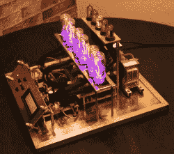
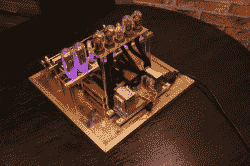
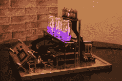

# 在电子管数量上毫不吝啬的谢妮钟

> 原文：<https://hackaday.com/2012/11/02/nixie-clock-that-doesnt-skimp-on-the-number-of-tubes/>

[尼娜·布卢姆]认为，如果你要麻烦地驾驶谢妮地铁，你也可以大量使用它们。这款钟的详细信息直接发送到我们的 tips 热线，列出了总共使用的十三根电子管。有六个俄罗斯 IN-8 管(大数字)，四个 Z573M 管(小数字)，但结肠管和正弦波管零件号未指定。

ATmega8 通过一组晶体管控制这些段。为了操作显示器，[Nina]包括一个由五个按钮和一个四行字符 LCD 组成的用户界面。有一个视频展示了菜单系统，包括设置时间、日期和切换各种发光位的方法。我们正在等待批准将该片段发布到我们的 YouTube 频道上，因为[尼娜]只包含了电影的快速共享链接。休息过后，你会看到更多的图片，如果我们顺利的话，我们会嵌入视频。

