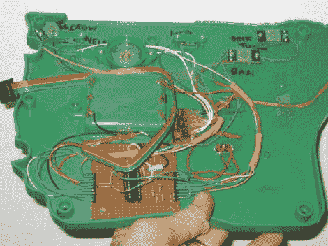

# 黑客农场玩具扮演西蒙

> 原文：<https://hackaday.com/2012/11/04/hacked-farm-toy-plays-simon/>

> 我的孩子有一个塑料农场玩具。它哞哞叫，呜呜叫，嘶叫，咩咩叫，坦白地说，它还在抱怨。但既然我在 2313 年用一个
> 把它骗了出来，至少它能玩“西蒙说”。

这是[汤姆]在给我们的电子邮件中说的。我们喜欢当玩具惹恼[汤姆]时，他改进它。

他从植入自己的电子设备开始。他用 ATTiny2313 做大脑，把它变成了一个有趣的“西蒙说”的游戏。每个摊位都是一个按钮，里面有一个漂亮明亮的 LED 灯帮助你跟随。有趣的是，他还保留了原来的电子设备，并添加了一个开关，这样他就可以改变模式。干得好[汤姆]！

休息后看视频。

[https://www.youtube.com/embed/Cw1cQGUrFPM?version=3&rel=1&showsearch=0&showinfo=1&iv_load_policy=1&fs=1&hl=en-US&autohide=2&wmode=transparent](https://www.youtube.com/embed/Cw1cQGUrFPM?version=3&rel=1&showsearch=0&showinfo=1&iv_load_policy=1&fs=1&hl=en-US&autohide=2&wmode=transparent)