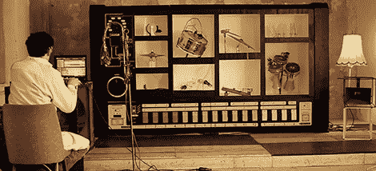

# MR-808 是最著名的鼓机的机械版本

> 原文：<https://hackaday.com/2012/11/05/mr-808-is-a-mechanical-version-of-the-most-famous-drum-machine/>

听过 80 年代音乐的人都听过臭名昭著的 TR-808 鼓机的打击乐效果。对现代人来说，这听起来像是古董。成为有史以来最受欢迎的架子鼓意味着它一定有一些可取之处，对吗？

[莫里茨·西蒙·艾斯特]决定他不想与 TR-808 的懦弱的计算机模拟有任何关系。相反，[他选择了一个更机械的版本](http://sonicrobots.com/mr808-eng/),将机器人放在一个巨大的 808 外壳中，与任何 MIDI 鼓轨道合拍演奏圈套、高帽、牛铃和鼓。

[Moritz]将他的作品称为 MR-808，并将现实生活中的低音鼓、陷阱、帽子、手鼓、拍手和乘坐装置放入 3.3 x 1.7 米(10.8 x 5.5 英尺)的箱子中。声音触发器由 Max/Msp 通过与一对 Arduinos 通信来处理螺线管和灯光效果。您可以在[Moritz]' [幕后花絮](http://sonicrobots.com/2012/10/07/behind-the-scenes-the-technique-of-the-mr-808-a-robo-mechanic-tr-808-replica-sound-installation/)中了解更多关于硬件设置的信息。

休息之后，您可以看到 MR-808 的运行，无论是单独还是为[Moritz]'乐队提供打击乐器。一个非常酷的建筑，现在急需一个 Arduinofied 贝斯手放在一个杂草丛生的 TB-303 围栏里。

[https://player.vimeo.com/video/52766487](https://player.vimeo.com/video/52766487)[https://player.vimeo.com/video/52770815](https://player.vimeo.com/video/52770815)