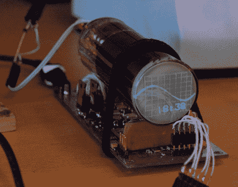

# 定制电路驱动小型圆形 CRT 显示器

> 原文：<https://hackaday.com/2012/11/05/custom-circuit-drives-a-small-round-crt-display/>

[斯沃夫斯基]最新的黑客手段无非是想让自己在办公桌上看起来很酷。我们会说任务完成了。他甚至不需要周围的任何人来为他组装的小圆形 CRT 显示器感到骄傲。当日常工作变得有点乏味时，让它在他身边嗡嗡作响就足够让他继续下去了。

使用阴极射线管的最大挑战之一是电源。他将这些要求与谢妮电子管的要求进行了比较，这更具挑战性，因为他想从 12V 的 DC 电源产生 750V 的电压。为了成功，他亲手给自己的变压器上了发条。有两个次级线圈，一个用于阴极加热器，另一个作为电源。休息后，您可以看到该单元的一个简短剪辑。

注意他文章中的 PCB 部分。在印刷电路板之前，他浏览了几个不同的软件包。它从 Eagle 开始，转移到[freerouting.net](http://www.freerouting.net/)，产生了一个 Specctra 文件，他使用 Python 脚本将其转换为 gEDA。

[https://www.youtube.com/embed/F14l7hR6vC4?version=3&rel=1&showsearch=0&showinfo=1&iv_load_policy=1&fs=1&hl=en-US&autohide=2&wmode=transparent](https://www.youtube.com/embed/F14l7hR6vC4?version=3&rel=1&showsearch=0&showinfo=1&iv_load_policy=1&fs=1&hl=en-US&autohide=2&wmode=transparent)