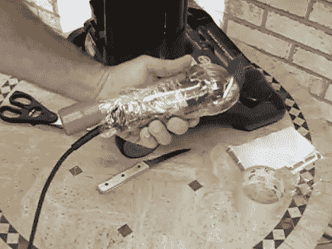

# [卢的]发型真的很烂

> 原文：<https://hackaday.com/2012/11/05/lous-haircut-really-sucks/>

啊，是的，在某个时候，一个杰出的发明家将电动修剪器和真空吸尘器结合在一起，理发的艺术从此不再一样。[Lou]正在向我们展示如何理发，真正吸收废物。他用他周围的垃圾做了这件事。

大多数人会认为这是 DIY 版的 Flowbee。毫不奇怪，如果你想的话，你仍然可以买一个，但[Lou]正在寻找一个真空切割机来修剪他的狗的毛发，所以他不打算支付现金。他已经有了修剪器，只是需要一种方法来连接真空软管。在上图中，你可以看到他的吸尘器的灰色缝隙附件。他用胶带把它粘在修剪器上，然后在修剪器的工作端附近剪下一个塑料汽水瓶作为头罩。它被包装带包裹着，把所有的东西都固定在适当的位置，并在接缝处密封。休息之后，您可以在视频中看到它的实际效果。

[https://www.youtube.com/embed/bC8IgBX7_eY?version=3&rel=1&showsearch=0&showinfo=1&iv_load_policy=1&fs=1&hl=en-US&autohide=2&wmode=transparent](https://www.youtube.com/embed/bC8IgBX7_eY?version=3&rel=1&showsearch=0&showinfo=1&iv_load_policy=1&fs=1&hl=en-US&autohide=2&wmode=transparent)