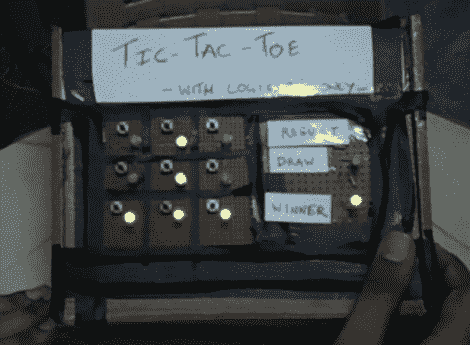

# 来自逻辑芯片的双人井字游戏

> 原文：<https://hackaday.com/2012/11/05/two-player-tic-tac-toe-from-logic-chips/>

这是另一个 7400 逻辑竞赛的参赛作品。[Circuitchef]使用盖茨和一些触发器构建了一个两人电子井字游戏。他在帖子中链接的 PDF 文件中分享了全部细节。我们还在休息后链接到它，以防他正在使用的 Dropbox 变得不可用。

他提供了一个很好的框图，有助于理解游戏的设计。该板由 3×3 矩阵的瞬时按钮和双色 led 组成。每个玩家轮流按下他们想要认领的方块中的按钮。输入电路使用触发器来确定该轮到哪个玩家了，并为该方块点亮适当的颜色。一组 3 输入与门监控获胜图案的所有可能组合。这些门的输出被“或”降低到仅一个输出，该输出用于以正确的颜色点亮“赢家”LED。如果所有的盒子都被点亮，并且没有一个组合是令人满意的，那么这个游戏就被宣布为平局。这些都可以在文件夹下面的演示中看到。

[项目设计细节](http://hackaday.com/wp-content/uploads/2012/11/circuitchef-7400-tic-tac-toe.pdf) (PDF)

[https://www.youtube.com/embed/LSIJgAMQTiI?version=3&rel=1&showsearch=0&showinfo=1&iv_load_policy=1&fs=1&hl=en-US&autohide=2&wmode=transparent](https://www.youtube.com/embed/LSIJgAMQTiI?version=3&rel=1&showsearch=0&showinfo=1&iv_load_policy=1&fs=1&hl=en-US&autohide=2&wmode=transparent)