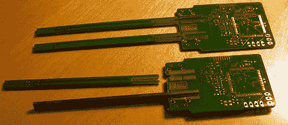

# 用自制智能镊子测量 SMD 零件

> 原文：<https://hackaday.com/2012/11/07/measuring-smd-parts-with-a-home-brew-version-of-smart-tweezers/>

SMD 器件很棒；它们允许你在一个板上组装更多的元件，不需要钻几十个印刷电路板，如果操作正确，可以在家庭实验室生产出工厂质量的电路板。SMD 器件有一个问题:故障排除和测量。理想的解决方案是类似于我们之前见过的智能镊子的东西，但是这个神奇的工具要花费 300 块骨头。[Kai]想出了一个便宜得多的解决方案:[家酿智能镊子](http://xyphro.de/blog/comments.php?y=12&m=08&entry=entry120806-210136)，其制造成本是专业型号的十分之一。

[Kai]建立的是一个 LCR 计，基本上是一个以非常非常小的外形测量电感、电容和电阻的工具。测量器件特性的技术包括将设定的频率输入设备，并测量输出的相位、电压和电流。EEVblog 的[【戴夫】在他早期的一个视频中对此做了精彩的解释。](http://www.youtube.com/watch?v=fs2MfTW4o_Q#t=3m00s)

[Kai]正在使用的硬件包括手机的 LCD 显示屏、基于 MSP430 的微控制器、镊子尖端附近的一个非常小的运算放大器，以及用于测量组件的可编程增益放大器。在测试中，[Kai]可以测量精度为+/- 2%的极低值元件，以及精度为+/- 0.25%的更大、更真实的元件。这是一项了不起的成就，远远优于无法在 nH/pF/mω范围内测量的常见中国电表。

[Kai]还没有让他的智能镊子工作起来——他仍然需要让电路启动并运行，并编写一些软件。不过，我们会让我们的读者了解[Kai]的进展，并温和地说服他与 Seeed Studio 或类似的人合作，将他的智能镊子版本放到世界各地制造商的工作台上。