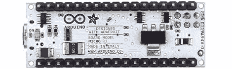

# Adafruit 有了新的主板，一个官方的 Arduino

> 原文：<https://hackaday.com/2012/11/09/adafruits-got-a-new-board-an-official-arduino/>

城里有一个新的 Arduino，这次是与 Adafruit 联合设计的。这是 Arduino Micro，一个为试验板设计的非常简洁的小板子。

从表面上看，这款新的 Micro 是长在牙齿上的 Arduino Nano 的升级版，它吸收了新 Arduino Leonardo 的所有最佳功能，并将其缩小为一个口香糖大小的方便棒。它由 ATmega32u4 微控制器供电，通过一个 MicroUSB 端口可以模拟键盘、鼠标和其他 USB 输入设备。

当然，对于任何微控制器开发板，必须在 Arduino Micro 和非常受欢迎的 [Teensy USB 开发板](http://www.pjrc.com/teensy/index.html)之间进行比较。像 Teensy 板(和新的 Arduino Leonardo)一样，Micro 可以充当 USB 键盘或鼠标。然而，Teensys 装载了 [LUFA](http://www.fourwalledcubicle.com/LUFA.php) ，这使得它能够模仿从鼠标、USB 音频设备到 MIDI 合成器的任何东西。