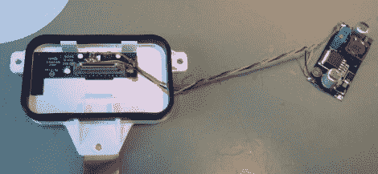

# 为旧 Apple 配件添加充电功能

> 原文：<https://hackaday.com/2012/11/09/adding-charging-back-to-old-apple-accessories/>

我们不时会因为苹果配件缺乏向后兼容性而感到沮丧。我们有一个很棒的 Monster FM 发射器，它使用原始 iPod 的屏幕来选择频道。这是一个我们非常喜欢的功能，但它从来没有在任何未来的硬件上使用过。我们可能无法恢复，但也许这次黑客可以帮助我们[实现使用旧配件为新苹果设备充电的能力](http://blog.maclabor.de/post/35286908784/dust-your-ipod-hi-fi)。

上面看到的是 2006 年发布的 iPod Hi-Fi 扬声器的安装基座。显然，这套扬声器的声音非常棒，但你无法在播放音乐的同时给你的现代设备充电。除非你不怕焊接几个简单的元件，并加入一个至少能提供 1 安培电流的开关稳压器。正如我们过去所见，[苹果使用几个分压器来识别现代充电器](http://hackaday.com/2010/08/03/reverse-engineering-apples-recharging-scheme/)。这些被安装在 USB 连接器的 D+和 D-线上，如果你知道设备正在寻找的电压电平，它们很容易被重新创建。在这种情况下，一个 39K、两个 51k 和一个 75k 表面贴装电阻就在 Hi-Fi 的 dock PCB 连接器旁边自由形成。右边的调节器提供充电用的果汁。它现在可以为现代设备充电，如果你使用简单的 dock connector 适配器，甚至可以与 iPhone 配合使用。