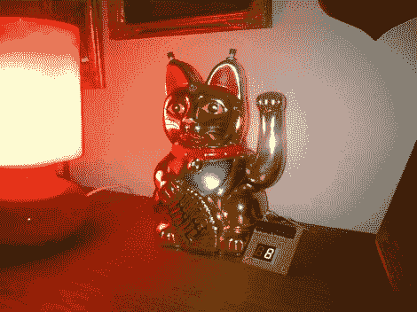

# 招财猫点击数

> 原文：<https://hackaday.com/2012/11/11/lucky-cat-hit-counter/>

[Jan]正在寻找一种坐在沙发上监控网站点击率的方法。这导致了[招财猫命中计数器](http://www.instructables.com/id/Arduino-powered-Lucky-Cat-as-physical-Webcounter/ "Lucky Cat Hit Counter")。黑客给了一只股票招财猫一些新的硬件:一个伺服系统，一个 RGB led，一个光传感器和一个 7 段显示器。添加的组件由一个 [Arduino 以太网](http://www.arduino.cc/en/Main/ArduinoBoardEthernet "Arduino Ethernet")控制。

Arduino 以太网被设置为 web 服务器。当访问者访问[Jan]的网站时，Arduino 会请求一个 GIF。这个触发器改变了 RGB LED 的颜色，增加了七段显示，当然，通过启动伺服系统产生了 cat 波。光传感器是用来让猫在晚上保持安静的。当光线值低于某个阈值时，将进入夜间模式，猫不会摆动。

休息之后是一段视频，展示了招财猫收到一些 HTTP 请求。

[https://www.youtube.com/embed/2HNAYZXkWnM?version=3&rel=1&showsearch=0&showinfo=1&iv_load_policy=1&fs=1&hl=en-US&autohide=2&wmode=transparent](https://www.youtube.com/embed/2HNAYZXkWnM?version=3&rel=1&showsearch=0&showinfo=1&iv_load_policy=1&fs=1&hl=en-US&autohide=2&wmode=transparent)