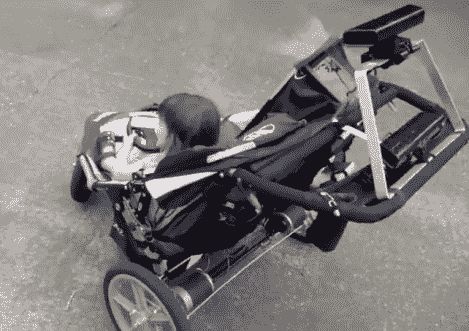

# 机器人推车让婴儿驾驶，而不会撞倒其他幼儿

> 原文：<https://hackaday.com/2012/11/12/robot-stroller-lets-baby-steer-without-mowing-down-other-toddlers/>

我们已经看到婴儿车和汽车座椅有一个供婴儿玩耍的方向盘(就像《辛普森一家》的开场一样)。但是我们没有看到的是[一辆可以让婴儿真正驾驶的婴儿车](http://daddiorobotics.com/mechanizedstroller/)。你可能会认为，把一辆机动车交到一个如此年轻的人手中，是一场迟早会发生的事故。但是[Xandon Frogget]想到了这一点，并使用熟悉的硬件添加了一些安全功能。

上面看到的婴儿车是一个三轮车设置，很容易为两个后轮添加电机。这些由一个平板电脑控制，你可以看到它坐落在婴儿车的顶篷上(寻找玻璃上反射的光)。这与两个 Kinect 传感器接口，一个指向前方，另一个指向后方。他们不断扫描环境，寻找婴儿车路径上的障碍。你可以看到[Xandon 的]小女孩拿着一个 Wii 轮，它与平板电脑相连，方便转向。休息之后，在操场上进行一次测试。

[https://www.youtube.com/embed/9e9E9nybK0Y?version=3&rel=1&showsearch=0&showinfo=1&iv_load_policy=1&fs=1&hl=en-US&autohide=2&wmode=transparent](https://www.youtube.com/embed/9e9E9nybK0Y?version=3&rel=1&showsearch=0&showinfo=1&iv_load_policy=1&fs=1&hl=en-US&autohide=2&wmode=transparent)