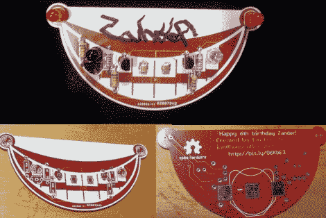

# 生日徽章教孩子们如何焊接

> 原文：<https://hackaday.com/2012/11/12/birthday-badges-teach-kids-how-to-solder/>

[大伊恩·李]想在他小儿子的生日聚会上搞一个教育活动。这些对他来说都是未知的领域，因为他不记得教育是在他早年的生日聚会上进行的。但是他想出了一个好主意，用互动徽章来教授焊接，每个客人都可以自己组装徽章。他需要大约 20 个，所以他尽量把炸弹控制得小一些。但这并不意味着在功能上有所欠缺。

您可以在上面组装好的徽章左侧看到黑色 LED 型包装。这是一个红外接收器，其对应的发射器位于电路板的右侧。当其中两个相距 6-8 英寸时，他们开始来回交谈。该系统不涉及微控制器，而是依靠多谐振荡器设计。“微笑”一角的一个红色发光二极管一直在闪烁。当它关闭时，红外发射器通电。另一个徽章的接收器接收到这个信号，点亮第二个“微笑”LED。你可以在休息后的短片中看到这种情况。

尽管这其中涉及到的组件相对较少，但孩子们要花很长时间才能将它们组合在一起，因为他们刚刚开始学习。[Ian]和他的大儿子事先焊接了除电阻以外的所有元件。

[https://www.youtube.com/embed/WgKXDJ-iNc8?version=3&rel=1&showsearch=0&showinfo=1&iv_load_policy=1&fs=1&hl=en-US&autohide=2&wmode=transparent](https://www.youtube.com/embed/WgKXDJ-iNc8?version=3&rel=1&showsearch=0&showinfo=1&iv_load_policy=1&fs=1&hl=en-US&autohide=2&wmode=transparent)