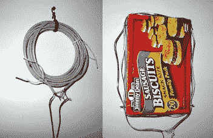

# 无线热水器监视器使用周围的任何东西

> 原文：<https://hackaday.com/2012/11/13/wireless-water-heater-monitor-uses-whatever-was-lying-around/>

[克里斯]着手为他的热水器建立一个监控系统。它不发微博，也不发短信。当热水器处于活动状态时,,它会点亮一个 LED。有一件事让设置变得复杂了，那就是他不想把任何电线从车库拉到房子里。你在上面看到的是他用来完成这个目标的无线设置。

这是一个电热水器，所以[克里斯]接入了 230 伏的加热元件。当热水器闲置时，这种连接被切断。他用变压器将电压降低到 17V，并在馈入 7805 电源调节器之前进行整流。发射器电路的其余部分由一个 555 定时器组成，驱动左侧所示的线圈。它是由电话线制成的，内部四根导线中的每一根都连接在一起，以增加绕组的数量。早餐香肠盒里有接收器线圈。他的硬件从线圈中获取感应电流并放大它，将信号馈送到负责切换状态 LED 的晶体管的基极。这可以穿透 6 英寸厚的车库墙壁，尽管他不得不在接收端使用电池，因为他的壁灯给系统注入了太多的噪音，无法工作。