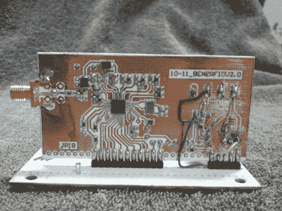

# 腕带 RFID 解锁车门并启动发动机

> 原文：<https://hackaday.com/2012/11/14/wristband-rfid-unlocks-car-door-and-starts-engine/>

[joo Ribeiro]白天是一名电子工程师，但在空闲时间，他喜欢从事日常用品方面的工作。最近，他一直在集成自己的微控制器网络，通过 RFID 解锁并启动他的汽车。除了拆开汽车内部的喜悦之外，他还花时间设计自己的 uC 分线板，并从单个芯片开发 RFID 阅读器。

他正在驾驶一辆 1988 年的奔驰，这辆车几乎没有电子设备。听起来像是原型车甚至不包括 CAN 总线，所以 RFID 黑客的前奏让他安装了由两个微控制器组成的 CAN 总线网络。一个读取速度和转速，而另一个显示在转速表上。当他开始基于标签的进入系统时，他使用 RFID 阅读器模块进行原型设计，但最终围绕 TRF7960 芯片构建了自己的阅读器。这包括蚀刻他自己安装在侧视镜支架上的接收器线圈。为了打开车门，他把手镯举到镜子前，汽车让他进去。休息后的视频以完整项目的演示开始，然后转到一些构建视频。

我们当然喜欢使用手镯的想法，而不是将标签植入你手的肉肉部分。

[https://www.youtube.com/embed/yiddeFcrR3E?version=3&rel=1&showsearch=0&showinfo=1&iv_load_policy=1&fs=1&hl=en-US&autohide=2&wmode=transparent](https://www.youtube.com/embed/yiddeFcrR3E?version=3&rel=1&showsearch=0&showinfo=1&iv_load_policy=1&fs=1&hl=en-US&autohide=2&wmode=transparent)