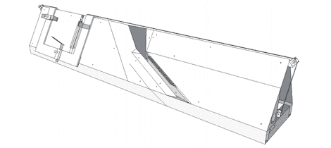

# 谷歌图书团队开源了他们的图书扫描仪

> 原文：<https://hackaday.com/2012/11/16/google-books-team-open-sources-their-book-scanner/>

众所周知，谷歌一直在扫描成千上万的书籍，希望重现亚历山大图书馆。出版商和作者真的不喜欢这个想法，所以谷歌图书团队正在做退而求其次的事情:他们[发布了一个非常智能的图书扫描仪](https://code.google.com/p/linear-book-scanner/)的计划，希望其他人会接过火炬，为曾经写过的每本书创建一个数字图书馆。

与我们看到的依赖操作员手动翻页的其他书籍扫描仪不同，这种线性书籍扫描仪在将它们通过桌面扫描仪的两个图像传感器后，在真空吸尘器和巧妙设计的金属片结构的帮助下自动翻页。

材料清单约为 1500 美元，但根据官方设计文件，这包括一个非常昂贵的扫描仪，可以用几个回收的平板扫描仪取代真正的黑客风格。

休息过后，你可以看看由[Dany Qumsiyeh]主持的谷歌技术讲座，讨论他的 DIY 图书扫描仪的设计和功能。在谷歌代码页上还有一个相对完整的设计文档。

[https://www.youtube.com/embed/4JuoOaL11bw?version=3&rel=1&showsearch=0&showinfo=1&iv_load_policy=1&fs=1&hl=en-US&autohide=2&wmode=transparent](https://www.youtube.com/embed/4JuoOaL11bw?version=3&rel=1&showsearch=0&showinfo=1&iv_load_policy=1&fs=1&hl=en-US&autohide=2&wmode=transparent)