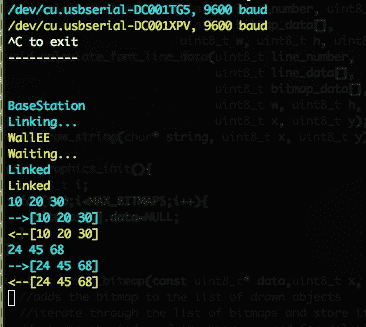

# Python 脚本允许您一次监控多个串行设备

> 原文：<https://hackaday.com/2012/11/16/python-script-lets-you-monitor-multiple-serial-devices-at-once/>

不知道你的电子项目内部发生了什么，会让你很难排除这些错误。[John]在几台设备之间进行无线通信时遇到了这个问题。几乎在同一时间，他的朋友想出了一个脚本，让你在一个终端窗口中监控多个串行设备。

我们习惯于使用 minicom，这是一个 Linux 包，在处理各种串行连接时可以完成这项工作。但是[John]是对的，我们非常确定每个 minicom 实例只能连接一个设备。但是[Jim 的] Python 串行终端([在这个 git 库](https://git.jim.sh/jim/terminal.git)中可用)允许您指定多个设备作为命令行参数。您甚至可以使用通配符来监控每个 USB 连接。然后脚本自动为每个设备选择不同的颜色。

上图来自[John 的]无线项目。即使没有任何其他背景，这也显示了用这种方式调试是多么容易，而不是在窗口之间来回切换，这很快就会变得混乱。