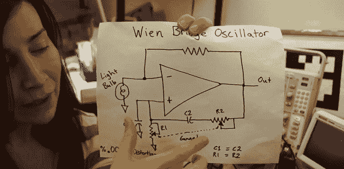

# [Jeri]在振荡器中使用灯泡

> 原文：<https://hackaday.com/2012/11/18/jeri-uses-light-bulbs-in-an-oscillator/>

早在 Ellsworth 女士]还是个孩子的时候，她就在各种运算放大器书籍中一遍又一遍地看到相同的电路。这是一个文氏电桥振荡器，一个在灯泡的帮助下输出正弦波的小电路。现在[Jeri]聪明多了，她决定用这个奇怪的振荡器玩一玩，发现它实际上对一个灯泡来说相当令人印象深刻。

文氏电桥有趣的部分是电路的增益部分。这只是一个简单的电阻分压器，在它的一条腿上放了一个灯泡。当电流增加时，这导致灯泡升温(虽然不足以发光)。当温度升高时，灯泡中的电阻增加，使振荡器达到平衡。

这是一个聪明的设置，但是把灯泡换成电阻怎么样？在视频中，[Jeri]尝试这样做，但却一团糟。灯泡电路非常稳定，失真非常低，电阻电路在示波器上看起来像一场灾难，到处都是谐波*。*

 *这是一个非常酷的构建，非常适合音频合成器，但正如[Jeri]在她的 YouTube 评论中所说，“这对于独立乐队来说没有足够的失真。”

[https://www.youtube.com/embed/vBsSASge7ls?version=3&rel=1&showsearch=0&showinfo=1&iv_load_policy=1&fs=1&hl=en-US&autohide=2&wmode=transparent](https://www.youtube.com/embed/vBsSASge7ls?version=3&rel=1&showsearch=0&showinfo=1&iv_load_policy=1&fs=1&hl=en-US&autohide=2&wmode=transparent)*