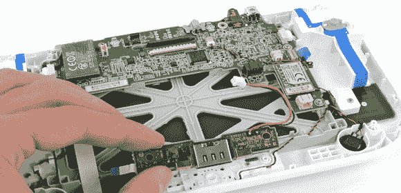

# 拆掉 Wii U

> 原文：<https://hackaday.com/2012/11/19/tearing-down-the-wii-u/>

随着 Wii U 上周末的发布，我们知道用不了多久我们就会在互联网上看到那些精彩的镜头。iFixit 的人拆掉了一台 Wii U T1，内部看起来有希望让一个潜在的黑客控制 Wii U 游戏手柄。

Wii U 游戏机中的组件[并不十分令人惊讶；一些无线控制器、HDMI 适配器、闪存芯片和 IBM Power CPU 构成了大多数有趣的组件。不过，游戏手柄的内部,](http://www.ifixit.com/Teardown/Nintendo+Wii+U+Teardown/11796/2)[看起来很有趣](http://www.ifixit.com/Teardown/Nintendo+Wii+U+Teardown/11796/3)。Wii U 游戏手柄似乎是由意法半导体制造的 ARM Cortex 微控制器驱动的，但游戏手柄板上主要集成电路的零件号是谷歌搜索不到的。

当然，视频如何从 Wii U 游戏机无线传输到游戏手柄仍然是个问题。iFixit 发现了一个 Broadcom BCM4319XKUBG 无线模块，可以在正常的 WiFi 频率下工作。这个模块已经在其他几款视频设备中使用，最著名的是 Boxee Box，所以有一些拦截传输到游戏手柄的视频信号并找出协议的可能性。

至少从黑客的角度来看，iFixit 被拆除的主要原因是，所有有趣的部分都使用了与任何其他可被黑客攻击的设备相似的硬件。希望我们能在年底前得到一个开放的 Wii U 游戏手柄。