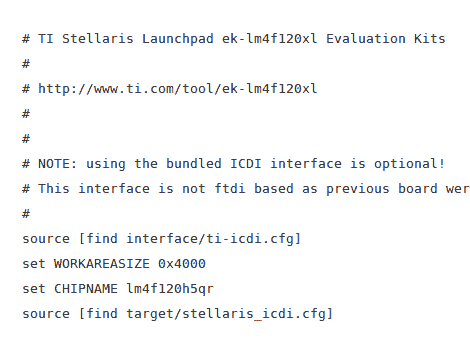

# 如何使用 Stellaris Launchpad 支持构建 OpenOCD

> 原文：<https://hackaday.com/2012/11/19/how-to-build-openocd-with-stellaris-launchpad-support/>

OpenOCD(一个开源的片上调试软件包)的稳定版本不支持 Stellaris Launchpad 板使用的 ICDI 协议。但是在修补它以使用协议之后，从源代码构建自己的 OpenOCD 是非常容易的。

我们已经看到过[一个用于将二进制图像闪存到 TI ARM 板](http://hackaday.com/2012/10/29/guide-to-developing-with-the-stellaris-launchpad-on-a-linux-box/)的开源工具。但这不能用于 GDB。随着最近在 OpenOCD 开发分支中包含基于 USB 的 ICDI，我们获得了该包附带的所有功能。我们很高兴听到这一点，因为我们在许多硬件架构中使用 OpenOCD，这使得该板的开发更像是正常的。

自从我们拿到 Stellaris Launchpad 后，它并没有一直放在壁橱里。当我们通过在线研讨会工作时，我们通过使用 lm4 工具对芯片[进行编程学到了很多。我们真的开始喜欢已经提供的 Stellarisware 外设库了。对我们来说，它的工作方式比 STM 在 ARM 探索板上使用的方式更直观。我们建议看一下工作簿 PDF(基本上是视频系列中内容的详细列表)和库参考(称为 SW-DRL-UG-9453.pdf ),它在 Stellarisware 包的 docs 文件夹中。](http://processors.wiki.ti.com/index.php/Getting_Started_with_the_Stellaris_EK-LM4F120XL_LaunchPad_Workshop?DCMP=Stellaris&HQS=StellarisLaunchPadWorkshop)

[via [危险原型](http://dangerousprototypes.com/2012/11/18/tutorial-debug-stellaris-lm4fxxx-mcu-with-open-source-tools/)