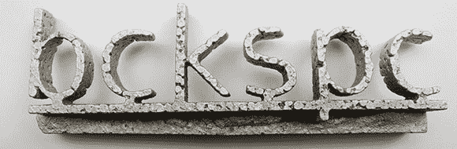

# 用数控机床切割聚苯乙烯泡沫塑料，把它变成铝

> 原文：<https://hackaday.com/2012/11/20/cutting-styrofoam-with-a-cnc-machine-and-turning-it-into-aluminum/>

将困在计算机世界中的物体变成真实的金属物体的最流行的方法之一是失蜡艺术，或失泡沫铸造。在这个过程中，用泡沫或蜡制作一个实物大小的金属模型，放在一堆沙子中，用熔化的金属烧掉。

在 Bamberg，德国 hackerspace Backspace 想出了一个非常聪明的构建，它可以自动将泡沫切割成所需的形状，准备带到后院的铸造厂。[构建](http://www.hackerspace-bamberg.de/Styroplotter_en)是基于一个旧的平板扫描仪和一个热线切割机。旧的扫描仪每个轴方便地具有相同数量的步骤，因此连接 Adafruit 电机屏蔽并更换旧的控制电子设备只是找到正确的电阻的问题。

软件控制由[一个处理应用程序【ptflea】提供](https://github.com/ptflea/Styroplotter)能够小心地切割非常精细的形状，即使是最稳定的手也会有困难。

用聚苯乙烯泡沫塑料做东西很酷，但这个项目的真正目标是点燃东西，融化旧散热器。聚苯乙烯泡沫塑料模具被放在一个装满沙子的桶中，炉子——几块伊通砖、一个坩埚和一个丙烷燃烧器——开始熔化一些铝。熔化的铝被倒在模具上，冷却后，Backspace 的制造商们有了一些非常酷的铝饰品。

一个很好的建筑，能够生产一些非常好的金属物品。不过，我们怀疑，如果你想自己建造，一种更高密度的泡沫(类似蓝色或绿色隔热板的东西，如果德国有这些东西的话)可以产生更高层次的细节。

休息后的视频。

[https://player.vimeo.com/video/42333638](https://player.vimeo.com/video/42333638)[https://player.vimeo.com/video/41205504](https://player.vimeo.com/video/41205504)[https://player.vimeo.com/video/42302000](https://player.vimeo.com/video/42302000)