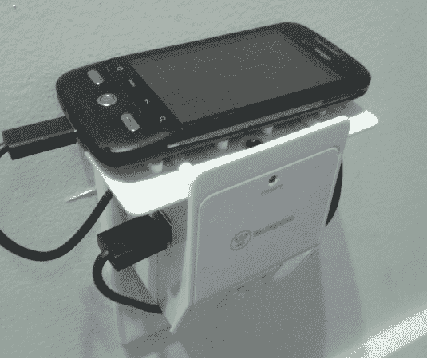

# 用 WiFi 路由器的内脏改装的插座充电站

> 原文：<https://hackaday.com/2012/11/20/outlet-charging-station-retrofitted-with-the-guts-of-a-wifi-router/>

在逛当地电子商店时，这个西屋 USB 充电站引起了詹姆斯的注意。他估算了一下，意识到这将是一个小型 WiFi 路由器的完美外壳。于是他开始了将 TP-Link TL-WR703N 改造成 DIY Pwn 插头的项目。

基本的想法是在一个看起来正常的设备中包含隐藏的功能。例如，看一看[这个价格高得离谱的电源板](http://hackaday.com/2012/07/22/power-pwns-price-tag-is-as-dangerous-as-its-black-hat-uses/),它碰巧也能监视你的活动。听起来[James]并没有计划任何黑帽活动，只是想要一个有趣的路由器应用程序。

他从充电站拆下了原来的电路板，为自己的内部部件腾出空间。他插入手机充电器为路由器供电，然后拆下 USB 端口和 RJ-45 连接器，将电路板放入机箱开口处。他甚至包括一个耳机插孔，可以断开串行端口。有很多新的东西装进去了，但充电站的所有原始功能都保持不变。