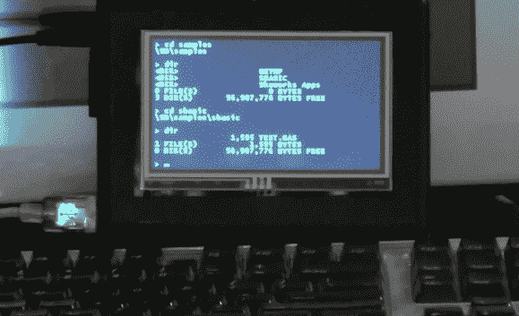

# 。NET 微框架用于基于提示的计算机

> 原文：<https://hackaday.com/2012/11/20/net-micro-framework-used-for-a-prompt-based-computer/>

[汤姆]正在用他的最新作品做一个小展示。NET 微框架的项目。他设法让一台基于提示的计算机在 FEZ Cobra 板上运行。

USB 键盘作为输入设备。为了给自己一个熟悉的导航和执行程序的方法，汤姆模仿了 DOS 的功能。上图中你可以看到他在 SD 卡上浏览数据时熟悉的目录列表格式。但是这比改变目录和列出文件更深入。他还可以访问控制外围设备的命令，展示 WiFi 连接的操作，并演示一些简单的代码来在屏幕上显示图像。因为硬件以。NET MF，任何为该环境编译的二进制文件也可以在提示符下执行。

休息后，查看嵌入项目的完整演示。

[https://www.youtube.com/embed/eN7MYvGKWp8?version=3&rel=1&showsearch=0&showinfo=1&iv_load_policy=1&fs=1&hl=en-US&autohide=2&wmode=transparent](https://www.youtube.com/embed/eN7MYvGKWp8?version=3&rel=1&showsearch=0&showinfo=1&iv_load_policy=1&fs=1&hl=en-US&autohide=2&wmode=transparent)

[谢谢少校]