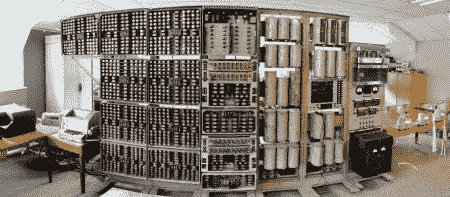

# 世界上最古老的数字计算机让我们想起了电话交换机

> 原文：<https://hackaday.com/2012/11/20/worlds-oldest-functioning-digital-computer-reminds-us-of-a-telephone-exchange/>

这是 WHICH，哈佛汉普顿的教学计算仪器。这是最古老的数字计算机，由于漫长的修复过程，你可以亲自去米尔顿凯恩斯(位于英国伦敦西北)的国家计算机博物馆参观。

该系统于 1951 年首次投入运行。它的功能既熟悉又陌生。首先，它使用十进制而不是二进制进行计算。它用机电开关代替晶体管，就像老式自动电话交换机中的开关一样。这导致非常嘈杂和缓慢的操作。用户的输入来自打孔的纸条。随着数据的积累，它会使用十电子管显示在寄存器中(从[开始，十电子管在业余爱好项目](http://hackaday.com/2009/04/06/dekatron-kitchen-timer/)中变得流行)。幸运的是，我们可以在[BBC 关于女巫](http://www.bbc.co.uk/news/technology-20395212)的报道中看到这一点。

根据设备上的[eLinux 页面显示，该设备从 1997 年到 2009 年一直被拆解入库。从那时起，它就被借给了博物馆，并一直在进行清理、重组和修复。](http://elinux.org/WITCH)

[谢谢大卫]