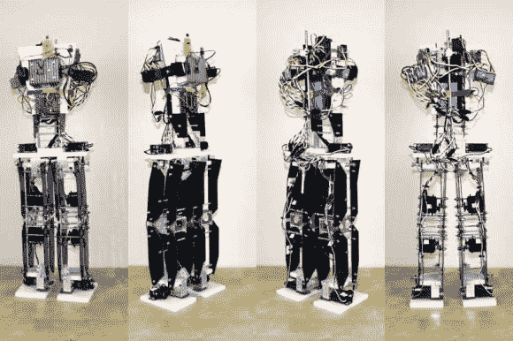

# [詹姆斯]双足机器人更新

> 原文：<https://hackaday.com/2012/11/21/update-on-james-bipedal-robot/>

从最新更新来看，[詹姆斯]在他的双足机器人上取得了相当大的进步。几天前，他在帖子的顶部添加了内容，但没有包括视频链接，你会发现视频链接会在休息后嵌入。在他开始演示静态和动态平衡之前，有大约 10 分钟的解释时间，可以使用电视遥控器上的按钮来选择静态和动态平衡。

大约一年前，我们参观了这个项目。最显著的变化是固定在机器人躯干上的控制电子设备。起初，它让我们有点紧张，他没有在组件周围建立一个保护性的笼子。但在看到最新的稳定性演示后，我们猜测这是因为这东西在保持直立方面非常棒。躯干在臀部以这样的方式连接，无论每条腿在哪里，它总是保持直立。这东西总共有 26 英寸高，但当他开始为它建造头部时，它还会长高。

[https://www.youtube.com/embed/gYUHsg8LnUc?version=3&rel=1&showsearch=0&showinfo=1&iv_load_policy=1&fs=1&hl=en-US&autohide=2&wmode=transparent](https://www.youtube.com/embed/gYUHsg8LnUc?version=3&rel=1&showsearch=0&showinfo=1&iv_load_policy=1&fs=1&hl=en-US&autohide=2&wmode=transparent)