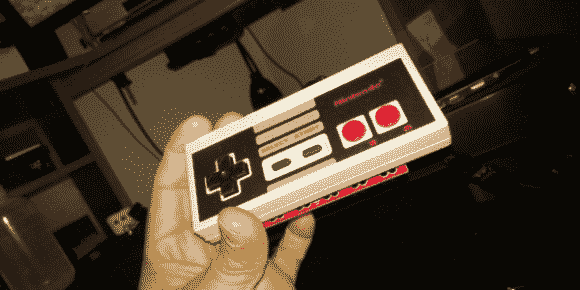

# 死去的 NES 控制者被用作马基的盾牌

> 原文：<https://hackaday.com/2012/11/22/dead-nes-controller-used-as-a-makey-makey-shield/>

【吉列尔莫·阿马拉尔的】NES 控制器状态极佳。好吧，除了它不起作用的事实。经过仔细观察，移位寄存器——这些古老外设上唯一的集成电路——似乎已经寿终正寝了。但是他通过把 NES 控制器做成一个 MaKey MaKey 盾让它再次可用。

你应该记得 MaKey MaKey。这是一个小板子，可以让你用任何东西来创建控制器——香蕉是更受欢迎的例子之一。他所需要做的就是把控制器的按钮连接到电路板上。对于这项任务，他选择使用超长引脚标题。为了找到外壳上的孔的位置，他在每个引脚的顶部涂上红色墨水，然后将 PCB 举到控制器的外面。在每个红色标记处钻孔后，他将引脚接头粘在适当的位置，并开始在控制器的原始电路板上钻孔。一旦所有的点对点连线完成，他就有了一个工作控制器。跳完之后在剪辑里自己看。

[https://www.youtube.com/embed/esLfn5qHh38?version=3&rel=1&showsearch=0&showinfo=1&iv_load_policy=1&fs=1&hl=en-US&autohide=2&wmode=transparent](https://www.youtube.com/embed/esLfn5qHh38?version=3&rel=1&showsearch=0&showinfo=1&iv_load_policy=1&fs=1&hl=en-US&autohide=2&wmode=transparent)