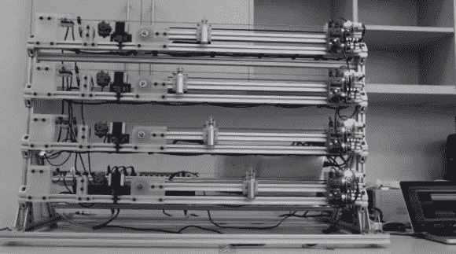

# MechBass:听起来很棒的机器人低音吉他

> 原文：<https://hackaday.com/2012/11/22/mechbass-a-robotic-bass-guitar-that-sounds-fantastic/>

[詹姆斯]来信向我们展示了他在惠灵顿维多利亚大学四年级的荣誉项目。他设计并制造了这个机器人低音吉他。休息之后，你可以听到缪斯乐队演奏的《集体歇斯底里》。听起来很棒，但是我们很想听没有完整伴奏的。

[James]没有为 MechBass 准备的网站，所以我们在下面提供了详细信息。

[https://www.youtube.com/embed/5UYMnzXQEtw?version=3&rel=1&showsearch=0&showinfo=1&iv_load_policy=1&fs=1&hl=en-US&autohide=2&wmode=transparent](https://www.youtube.com/embed/5UYMnzXQEtw?version=3&rel=1&showsearch=0&showinfo=1&iv_load_policy=1&fs=1&hl=en-US&autohide=2&wmode=transparent)

> *   Everything I designed with Solidworks, and myself assembled by laser cutting /3D printing. Most components have gone through 3 or more design iterations.
> *   The pitch shifter is open-loop, driven to the required position by a NEMA23 stepper, and the limit switch allows alignment at startup. The carriage is a custom design, riding on 80/20 using their low friction bearing pads. Igus cable bracket manages the wires of solenoid during movement.
> *   The control board is a completely customized design, based on ATMega328 (Arduino compatible), so it is programmed with IDE. The stepper motor driver is placed in the interface between the microcontroller and the stepper motor, while the MOSFET drives the solenoid. MIDI interface follows MMA standard and is used to connect devices on the bus. Each string only responds to the MIDI information on its designated MIDI channel. The decoupling capacitor and TVS near the driver can minimize the transient during braking of stepping motor (especially the motor used for pitch shifter). The servo system under the paddle wheel stepping motor makes the motor rotate, making the paddles close to or away from the strings, thus changing the volume of the paddles.
> *   The felt cover arm connected to the servo system allows the strings to be damped (muted) on demand (noteOff).
> *   Traditional bass head is used to tighten strings, and it is integrated at the top of the tonic height shifter assembly.
> 
> 这个项目非常注重细节，例如所有的伺服电缆都是手动延长的，而每根电缆都是整齐地套在一起并热缩的，所有执行器都有 molex 连接器。在这个项目中总共有 800 多个螺栓…还有很多其他的东西。

如果你想要一些关于设计和操作的细节照片和大量信息，这里有[詹姆斯]提供的一个简短的 PDF(哎呀，他不应该发表那个。网站即将推出)