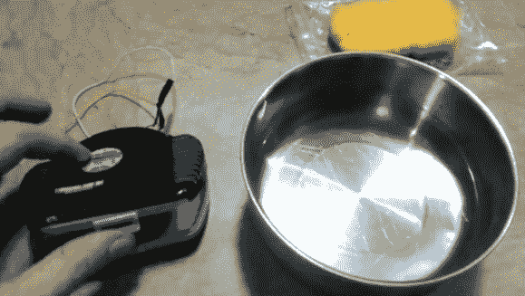

# 快速简单的个人蒸发冷却器

> 原文：<https://hackaday.com/2012/11/23/quick-and-easy-personal-evaporative-cooler/>

这种[快速简单的蒸发冷却器](http://www.philippinestuffs.com/mini-desktop-aircon/)可能正是下一次空调出故障时需要的东西。[斯蒂芬]看到一个易贝上市的个人空调，使用潮湿的海绵和风扇发送一些凉爽救济你的方式。但是他想在付现金之前进行自己的测试，看看它是否真的有用。

这个想法是让空气通过一个湿气源。空气中的一些热能通过蒸发减少，导致排出的空气感觉有点凉。这与沼泽冷却器(一种蒸发式空调)中使用的概念相同。为了制造他的装置，斯蒂芬抓了一个冰箱除臭器，这个除臭器用一个铰接的塑料笼子来装一包小苏打。他在笼子上安装了一个小风扇，然后插入一块湿海绵。这很容易组合起来，你可以在午休时去一元店，然后在下半个工作日放松一下。

如果你正在寻找一种更好的冷却技术，可以考虑利用啤酒冰箱作为个人冷却器。

[https://www.youtube.com/embed/53fXjb_ngCE?version=3&rel=1&showsearch=0&showinfo=1&iv_load_policy=1&fs=1&hl=en-US&autohide=2&wmode=transparent](https://www.youtube.com/embed/53fXjb_ngCE?version=3&rel=1&showsearch=0&showinfo=1&iv_load_policy=1&fs=1&hl=en-US&autohide=2&wmode=transparent)