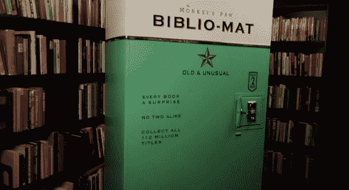

# Bilbio-mat 是一个很棒但很简单的二手售书机

> 原文：<https://hackaday.com/2012/11/22/bilbio-mat-is-an-awesome-yet-simple-used-book-vending-machine/>

你会在加拿大多伦多的猴爪发现这台旧书贩卖机。你可以花两个疯子从机器的储书器里买一本随机的书。傻？绝对的。但是你可以从休息后的视频中看到，以这种方式买书的行为非常有趣，我们总是喜欢看到这样一台机器的内部。

[克雷格·斯莫尔]的作品看起来很复古，每次拍卖都伴随着突突嘎-突突嘎和机械钟，与这种外观非常相配。机器当然是新的。外墙后面的三个料斗以 45 度角托着一摞摞的书。每一堆用绞盘和滑轮一次升起一个。一旦书堆上最上面的书足够高，可以滑入分发槽，绞盘停止，铃声响起。分配非标准尺寸物品的简单解决方案。

因为 Biblio-Mat 是用来清理打折书的，所以从滑道上掉下来造成的轻微损坏甚至不会被注意到。如果你最终真的喜欢这本书，你可以通过其中一个将它数字化。

[https://player.vimeo.com/video/53679084](https://player.vimeo.com/video/53679084)

[谢谢 Petri]