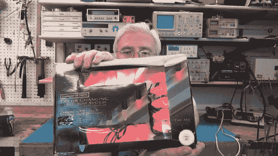

# 回顾 3 种 LED 灯串，开始圣诞装饰

> 原文：<https://hackaday.com/2012/11/24/kick-off-the-christmas-decorating-with-a-review-of-3-types-of-led-strings/>

[托德·哈里森]一直在寻求用更省电的 LED 灯取代他的白炽灯圣诞灯。有很多选择，但是到目前为止，他还没有找到任何一个他想要的样子。自去年以来，他购买了三种不同的产品进行试用，并发布了对每种产品的评论。

看看他在上面展示的一串 Brite Star 交响灯。有一个白色的“试试看”按钮，当绳子还在包装中时，它就会亮起！这提供了 15 个灯泡，每个相距 12 英寸。该线束在使用时消耗 8.4 瓦，您可以串联多达 30 根线束，它们是具有几种不同闪烁模式的 RGB 灯。在他的视频评论中，他在这一段花了将近一个小时。

在他的清单上的下一个是一套 Brite 明星经典风格的 C7 灯。它们是单色的，看起来像传统的大灯泡白炽灯丝。在每股 2.4 瓦的功率下，你可以将 87 组电池串在一起。这个视频在二十五分钟左右要简洁得多。

最后，他看着 Brite Star 50 迷你 LED 灯串。这些是传统的白色圣诞树灯，除了 LED 灯。灯串上每四英寸一个灯泡总共消耗 2.4 瓦的能量。你可以把 58 组绳子串在一起，形成一根 1000 英尺长的绳子。[Todd]花了不到 8 分钟的时间来回顾这个场景。

你可以在休息后看到一个介绍视频，但完整的评论链接在他的文章中。他真的很喜欢交响灯光，但其他股有一些问题。他讨论了他所看到的这些链中的设计缺陷，并认为由于闪烁，它们实际上并不可用。

[https://www.youtube.com/embed/c_lpMEazkw0?version=3&rel=1&showsearch=0&showinfo=1&iv_load_policy=1&fs=1&hl=en-US&autohide=2&wmode=transparent](https://www.youtube.com/embed/c_lpMEazkw0?version=3&rel=1&showsearch=0&showinfo=1&iv_load_policy=1&fs=1&hl=en-US&autohide=2&wmode=transparent)