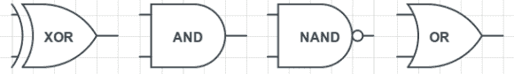

# 将晶体管抽象为高级设计

> 原文：<https://hackaday.com/2012/11/26/abstracting-transistors-into-high-level-design/>

虽然这不是理解计算机的最佳方式，但大多数人倾向于将电子设备想象成充满魔法和蓝色烟雾的黑匣子。即使是最基本的计算手段——微控制器，也被视为有金属腿的黑色塑料蜈蚣。在一系列的博客文章中，【Andrew Gibiansky】正在[拆除令人困惑的墙](http://www.gibiansky.com/2012/10/computing-with-transistors.html)并照亮晶体管、门和 FPGAs 的世界。

第一篇博客文章将电子电路视为瀑布；正电压是山顶上的水库，地面是海平面。这个想法被扩展到充当电子开关的低级晶体管，能够打开和关闭电路。

[继续学习逻辑门](http://www.gibiansky.com/2012/11/the-digital-state.html)，【Andrew】在学习触发器和 SRAM 之前，先学习非、与、或门。当然，这些可以是用 Verilog 和 VHDL 建模的[——编程语言，将晶体管和门的世界抽象成更易于人类阅读的形式。](http://www.gibiansky.com/2012/11/digital-design-tools-verilog-and-hdls.html)

[Andrew]的一系列博客文章还远未完成，但从他目前的工作来看，这似乎是一个很好的资源，可以将门和内存这些迟钝的概念解开，成为一个连贯的计算机设计。