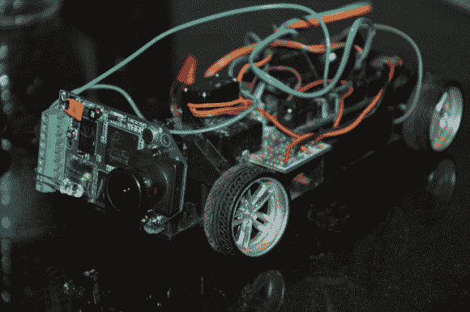

# 5 美元的玩具车升级为高清记录

> 原文：<https://hackaday.com/2012/11/26/5-toy-car-upgraded-to-record-the-ride-in-hd/>

我们希望[卡比尔的]驾驶技术是一流的，因为粘在这个玩具前面的摄像头是一个高价项目。具有讽刺意味的是，因为这辆被黑掉的遥控车的捐赠玩具只花了大约 5 美元。它一直在他卧室黑暗的角落里积满灰尘，直到他坐下来，给它一个适当的升级。

他开始了这个项目，摆脱了库存电池，转而使用一对锂聚合物电池。它们给车辆提供了更大的动力，两次充电之间的行驶时间增加了一倍以上。悬挂系统增加了几个弹簧，使行驶更加平稳。转弯一直是个问题，因为最初的设计无法控制车轮转动的距离。你只能辨认出他卷进系统的伺服电机的主体，以允许更精确的转动。

最近增加的是[车辆前面的 HackHD 摄像头](https://cpvrc.wordpress.com/2012/11/23/episode-2-hackhd-on-my-arduino-rc-racer)。它可以录制到 SD 卡上，而不是实时播放视频。休息之后，看看这个片段，看看在如此低的地面上拍摄所获得的有趣视角。我们要添加的一件事是，围绕板的笼子零售价约为 165 美元。

[https://www.youtube.com/embed/k0BLt1CVNcE?version=3&rel=1&showsearch=0&showinfo=1&iv_load_policy=1&fs=1&hl=en-US&autohide=2&wmode=transparent](https://www.youtube.com/embed/k0BLt1CVNcE?version=3&rel=1&showsearch=0&showinfo=1&iv_load_policy=1&fs=1&hl=en-US&autohide=2&wmode=transparent)