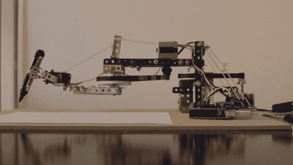

# 你好。来自一个讲西班牙语的绘图臂

> 原文：<https://hackaday.com/2012/11/27/hola-from-a-spanish-speaking-drawing-arm/>

[Acorv]来信告诉我们他的最新黑客技术，一个可以用记号笔写字的机器人手臂。在休息后的视频中，手臂被设置为复制任何人在触摸板上写的东西。正如你可能从这个视频中猜到的，黑客是用西班牙语写的，但如果你不会说这种语言，这不是你最喜欢的翻译不能处理的事情。

这个机器人是在他的第一个[绘图臂机器人](http://mesalioasi.blogspot.com.ar/2012/07/brazo-robot-dibujante.html "drawing arm bot 1")上改进的结果。在手臂的第二次迭代中，基本的运动学保持不变，但通过使用皮带实现齿轮减速，分辨率得到了极大的提高。第二个建筑也以机械加固为特色，带有一个被称为[【Mekanex】](http://translate.googleusercontent.com/translate_c?depth=1&hl=en&ie=UTF8&prev=_t&rurl=translate.google.com&sl=auto&tl=en&twu=1&u=http://www.meknex.com.ar/&usg=ALkJrhj4e0lxxaojuFBSRsyt5p5Jgw5e5A "Mekanex")的安装工风格的建筑组。

一个简单的业余爱好伺服移动标记向上或向下，控制是通过，你猜对了，一个带电机屏蔽的 Arduino 实现的！虽然来自不同的时代，但这个手臂的使用方式让人想起很久以前的一个机械写作机器人。

[https://player.vimeo.com/video/54118652](https://player.vimeo.com/video/54118652)