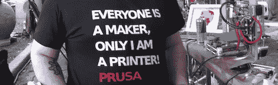

# [Prusa]的喷嘴打印聚碳酸酯、PEEK 和尼龙

> 原文：<https://hackaday.com/2012/11/27/prusas-nozzle-prints-polycarbonate-peek-nylon/>

哦，我们已经等了一段时间了。

最受欢迎的 3D 打印机的发明者【Josef Prusa】[刚刚发布了一款新的热门产品](http://prusanozzle.org/index.html)，它能够打印聚碳酸酯、聚醚醚酮和尼龙等材料的物体。

这种新的热端完全由不锈钢制成，没有聚四氟乙烯或聚醚醚酮制成的塑料部件来防止热量传递到挤出机。因为 Prusa 喷嘴可以打印这些塑料，现在也可以打印其他热端的零件，如 [J 头](http://reprap.org/wiki/J_Head_Nozzle)和 [Budaschnozzle](http://reprap.org/wiki/LulzBot/Budaschnozzle) 。

几个月前，我们在纽约创客节(NYC Maker Faire)上偶遇[Prusa]，他非常友好地介绍了他的新喷嘴和新 i3 打印机的进步。到目前为止，看起来缺少 PEEK 绝缘体并没有对新的热端造成任何伤害-[ Prusa]已经将熔融塑料留在喷嘴中几个小时了，没有任何不好的结果。

你可以看看下面的采访。

[https://www.youtube.com/embed/fzFpMZE366Q?version=3&rel=1&showsearch=0&showinfo=1&iv_load_policy=1&fs=1&hl=en-US&autohide=2&wmode=transparent](https://www.youtube.com/embed/fzFpMZE366Q?version=3&rel=1&showsearch=0&showinfo=1&iv_load_policy=1&fs=1&hl=en-US&autohide=2&wmode=transparent)

再次感谢[Prusa]接受我们的采访，并为[hack aday 主办的纽约创客节](http://hackaday.com/2012/08/01/hackaday-has-won-1st-place-in-the-redbull-creation-contest/)提供一些免费广告。在你抱怨面试延迟之前，不要担心；我在[Prusa]的夹克背面贴了几张 Makerbot 贴纸。一切都很好。