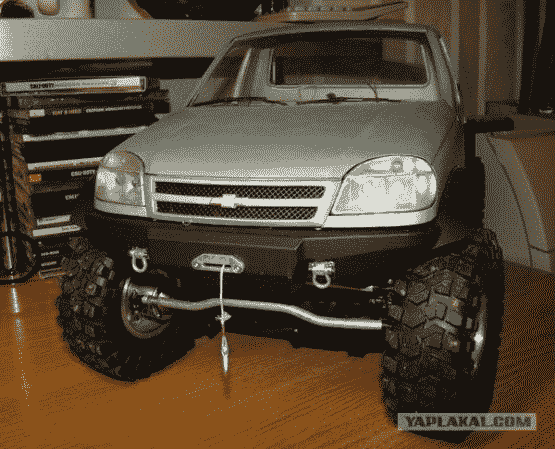

# 遥控卡车有工作窗口，方向盘，等等

> 原文：<https://hackaday.com/2012/11/27/rc-truck-has-working-windows-steering-wheel-and-much-more/>

这辆卡车不仅仅是一个传动系统和一个无线电模块。非常小心地制造每一个部件，使其像全尺寸汽车一样工作。 **NSFW 警告:**发布详细信息的论坛是俄罗斯的，可能会有你不希望出现在工作屏幕上的侧边栏广告。话虽如此，[下面是链接](http://www.yaplakal.com/forum11/topic394162.html) ( [译](http://translate.google.com/translate?sl=auto&tl=en&js=n&prev=_t&hl=en&ie=UTF-8&layout=2&eotf=1&u=http%3A%2F%2Fwww.yaplakal.com%2Fforum11%2Ftopic394162.html))。

该建筑从一个定制的框架开始，看起来像是铝制的。变速箱由大量零件组装而成，动力通过适当的差速器传递给车轮。但是，为什么不多做一点呢？挂在前面的绳子和钩子连接到一个功能绞盘上。车门上有可以向下转动的窗户，当车轮转动时方向盘会移动，如果没有挡风玻璃雨刷和前灯，这个东西会在哪里？休息之后不要错过这对演示视频。

我们记得看到[一个非常漂亮的斯特林发动机](http://hackaday.com/2012/03/09/tuna-can-and-some-other-trash-turned-into-a-sterling-engine/)出现在今年早些时候的同一个论坛上。

方向盘演示:

[https://www.youtube.com/embed/uy97EYbM48Y?version=3&rel=1&showsearch=0&showinfo=1&iv_load_policy=1&fs=1&hl=en-US&autohide=2&wmode=transparent](https://www.youtube.com/embed/uy97EYbM48Y?version=3&rel=1&showsearch=0&showinfo=1&iv_load_policy=1&fs=1&hl=en-US&autohide=2&wmode=transparent)

车窗和雨刷演示:

[https://www.youtube.com/embed/FczV_ef2tLw?version=3&rel=1&showsearch=0&showinfo=1&iv_load_policy=1&fs=1&hl=en-US&autohide=2&wmode=transparent](https://www.youtube.com/embed/FczV_ef2tLw?version=3&rel=1&showsearch=0&showinfo=1&iv_load_policy=1&fs=1&hl=en-US&autohide=2&wmode=transparent)

[通过 [PopGive](http://www.popgive.com/2012/01/incredible-homemade-rc-car.html) 感谢阿姆农]