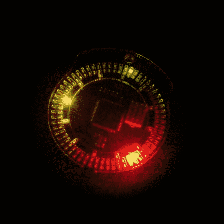

# LED 怀表

> 原文：<https://hackaday.com/2012/11/30/led-pocket-watch-2/>

[弗兰克]想要一种优雅的报时方式，所以他发明了一款 LED 怀表。这款手表有 132 个用于显示时间的 led，两个用于激活和改变模式的按钮，一个振动马达和一个蜂鸣器。

它由一个 picoPower [ATmega645P](http://www.atmel.com/devices/atmega645p.aspx) 控制，它有足够的引脚来驱动 led 阵列，一个内部实时时钟，以及低功耗。该设备位于激光切割丙烯酸面的后面，位于 3D 打印的外壳中。

为了给设备供电，[弗兰克]使用了可充电的锂纽扣电池。充电电路基于一个 [MCP73831](http://www.microchip.com/wwwproducts/Devices.aspx?dDocName=en024903) ，这是一个易于集成的充电控制 IC。USB 连接器用于为电路板供电。

该设计的一个更大的挑战是驱动大型 led 阵列。[Frank]使用 Charlieplexing 对 led 进行分组，并减少所需的引脚数量。他使用的另一个技巧是偏移 ISP 头引脚。这样就可以对 AVR 进行编程，而无需将连接器焊接到电路板上。

[Frank]的[说明书](http://www.instructables.com/id/LED-Pocket-Watch/?ALLSTEPS "Instructables Write-up")非常详细，包括原理图、PCB 布局、软件设计和机箱设计的解释。这是一本详细描述他的设计决策的好书。

休息之后，观看[Frank]关于该项目的视频概述。

[https://www.youtube.com/embed/22T7vB1ki6w?version=3&rel=1&showsearch=0&showinfo=1&iv_load_policy=1&fs=1&hl=en-US&autohide=2&wmode=transparent](https://www.youtube.com/embed/22T7vB1ki6w?version=3&rel=1&showsearch=0&showinfo=1&iv_load_policy=1&fs=1&hl=en-US&autohide=2&wmode=transparent)