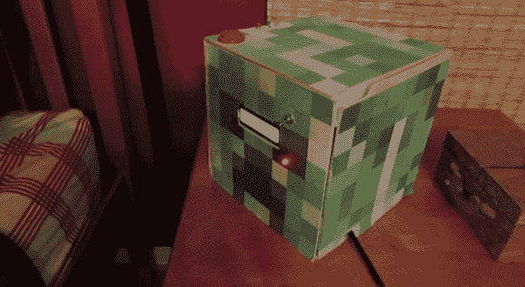

# 《我的世界》时钟收音机在你的床边放了一个爬虫头

> 原文：<https://hackaday.com/2012/11/30/minecraft-clock-radio-puts-a-creeper-head-next-to-your-bed/>

这个[闹钟收音机播放《我的世界》](http://imgur.com/a/FGOYC)的音乐，它被装饰得看起来就像一个爬虫头。在游戏中，暴徒的头像可以作为装饰品，而[Young_Maker]喜欢用一个爬行动物的头像来点缀他的虚拟床头柜。但是我们认为它的物理形态看起来一样好。

时钟的主要部分是一个带有字符液晶显示屏的 Arduino。DS1307 实时时钟可确保设备准确无误。在文章的标题中，我们称之为时钟收音机，但它更像是一个时钟 MP3 播放器。uMp3 板用于播放游戏中的随机音乐。我们会将配乐归类为极简主义，这是一种在早晨轻轻醒来的合理方式。但是如果时间用完了，会播放一个爆炸爬虫的声音来确保你上班不会迟到。

我们在跳转之后嵌入了[Young _ Maker]的演示视频。

[https://www.youtube.com/embed/MAbUEVL1KZE?version=3&rel=1&showsearch=0&showinfo=1&iv_load_policy=1&fs=1&hl=en-US&autohide=2&wmode=transparent](https://www.youtube.com/embed/MAbUEVL1KZE?version=3&rel=1&showsearch=0&showinfo=1&iv_load_policy=1&fs=1&hl=en-US&autohide=2&wmode=transparent)

[via [Reddit](http://www.reddit.com/r/arduino/comments/13ykzo/arduino_powered_minecraft_themed_clock_that_plays/)