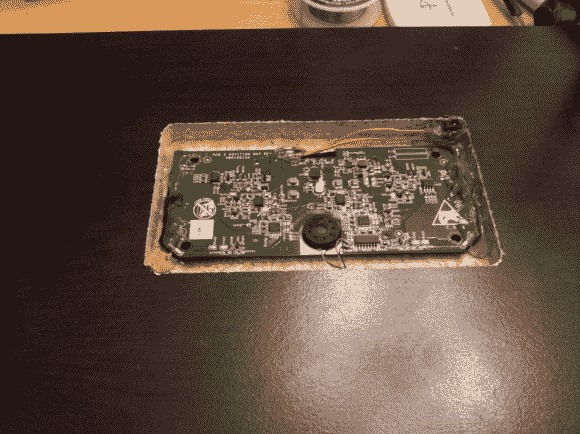

# 在家具内部隐藏感应充电站

> 原文：<https://hackaday.com/2012/12/02/hiding-an-inductive-charging-station-inside-furniture/>

[Tony]想要清理他的床头柜，去掉用来给他的设备充电的电缆。他通过在家具中集成感应充电站实现了他的目标。

他选择了一款名为 [Powermat](http://powermat.com/) 的产品。该设备的基站包括两个感应充电区域。[Tony]首先用一个刳刨机在这个架子的下面做一个口袋。他提到，剩下的木材只有 2 毫米厚，以允许适当的传输。在将印刷电路板粘合到位之前，他重新定位了电源插孔，这样仍然很容易够到。正如你在广告之后的视频中所看到的，这个系统以这种方式工作得很好。

关于托管此内容的论坛的一个说明。在编写特性时，我们必须加载线程三四次，除非我们注册，否则最终会被锁定。你可以通过在私人/匿名浏览器中加载链接来解决这个问题。

[https://www.youtube.com/embed/1gN8HB0i5_E?version=3&rel=1&showsearch=0&showinfo=1&iv_load_policy=1&fs=1&hl=en-US&autohide=2&wmode=transparent](https://www.youtube.com/embed/1gN8HB0i5_E?version=3&rel=1&showsearch=0&showinfo=1&iv_load_policy=1&fs=1&hl=en-US&autohide=2&wmode=transparent)