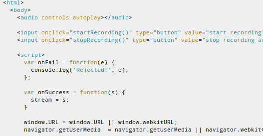

# 使用 HTML5 用 Chrome 录制音频

> 原文：<https://hackaday.com/2012/12/01/recording-audio-with-chrome-using-html5/>

当最新版本的谷歌 Chrome 浏览器停止使用 Adobe 的 flash 插件并过渡到他们自己的 Pepper Flash 时，Dubjoy 项目就停止了。开发的目的是产生一个基于浏览器的编辑器，用于翻译视频剪辑的音频轨道。经过一番挠头和大量研究后，他们决定尝试放弃使用 Flash，实现了一种使用 HTML5 录制音频的方法[。](http://codeartists.com/post/36746402258/how-to-record-audio-in-chrome-with-native-html5-apis)

一路上有不少问题。最初的录音技术生成了原始音频文件，Chrome 的 HTML5 音频播放器无法播放这些文件。这可以通过缓冲原始音频，然后在录音完成后将其转换为不同的格式来解决。用户还需要使用 Chromes 标志来启用 HTML5 音频。所以他们确实让它运转起来了，但这还不是一个平稳的过程。

我们喜欢看到你可以用 HTML5 做的漂亮的东西。我们最喜欢的一项功能是[将平板电脑的加速度计用作浏览器游戏控制器](http://hackaday.com/2012/03/26/accelerometer-based-game-control-using-an-ios-device-courtesy-of-html5/)。

[via [Reddit](http://www.reddit.com/r/programming/comments/13y4mp/how_to_record_audio_in_chrome_with_native_html5/)