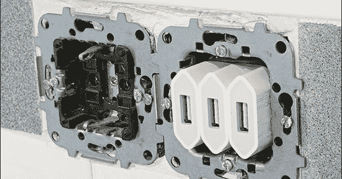

# 摆脱错综复杂的手机充电器

> 原文：<https://hackaday.com/2012/12/01/getting-rid-of-a-tangled-web-of-phone-chargers/>

每天晚上，[Roberto]的厨房柜台上都堆满了三部手机、三个不同的手机充电器和一堆乱七八糟的电线，直到第二天早上，充电器被移到抽屉里，供第二天晚上使用。对[Roberto]来说，这有点痛苦——一个简单得多的解决方案是在他的厨房后挡板上嵌入几个 USB 端口。使用合适的工具，[这可以很容易地完成](http://www.rbarrios.com/projects/usboutlet/)，从而为三部手机充电打造出非常专业的外观。

在移除了一个欧洲交流电源插座并用三个 iPhone 充电器替换后，[Roberto]只需将充电器上的六个电源连接焊接到他家的电线上。这导致了一个完美的功能，但相当丑陋的家庭项目。

下一步是为三个 USB 端口加工一个空白的交流插座盖。[Roberto]的数控加工厂快速加工了这块塑料，并把它变成了一个看起来很专业的装置。