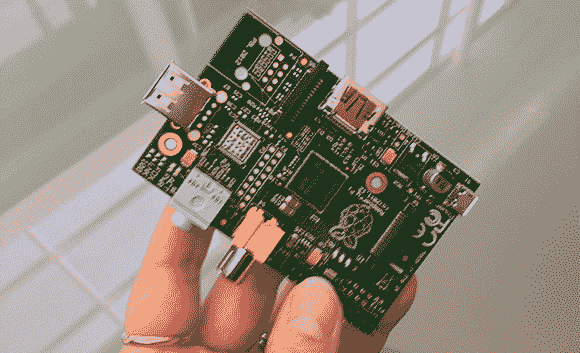

# 树莓 Pi 模型 A 即将推出

> 原文：<https://hackaday.com/2012/12/02/raspberry-pi-model-a-coming-soon/>

Raspberry Pi 基金会的[Liz]去了趟威尔士的制造厂，发现了第一批[A 型 Raspi 样品](http://www.raspberrypi.org/archives/2615)。它们只是样本，但这意味着我们应该很快就会看到一些树莓模型出现在元素 14 上。

作为 Raspberry Pi 的低成本型号，A 型缺少更完整的 B 型的一些功能。首先，没有以太网端口或控制器，只有一个 USB 端口，这大大降低了 A 型的功耗要求，Raspi Foundation [测量的功耗约为 B 型](http://www.raspberrypi.org/phpBB3/viewtopic.php?p=164893)的 1/3。

为了节省成本，型号 A 使用与型号 B 相同的 PCB 以太网控制器和端口根本没有安装。这似乎是一种降级，但如果你计划建造一架 Raspi 驱动的自主无人机，高空气球或其他机器人项目，降低功耗将是一个伟大的功能。