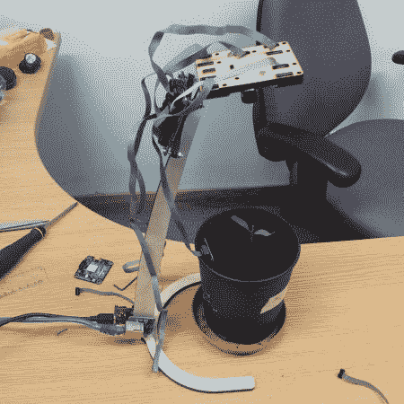

# Gadgeteer 工厂监视器希望它潮湿且上镜

> 原文：<https://hackaday.com/2012/12/03/gadgeteer-plant-monitor-wants-it-wet-and-photogenic/>

[Christian]正在他的桌子上种植一株番茄，他想拍摄一些其生长过程的延时照片。为此，他建造了一个监测湿度水平并定期拍摄图像的装置。

他用的硬件是小玩意家族的一部分。这些运行. NET 微框架，并且是模块化的，便于组装。激光切割胶合板支架有助于定位相机模块，以拍摄最佳照片。它每十分钟给幼苗拍一张照片。镜头周围有四个 RGB LEDs。它们有助于照亮每张照片的主题。但是[Christian]也提到红色发光二极管提供植物生长所需的光(我们对这种说法表示怀疑，但事实上我们不知道红色发光二极管是否能让植物生长)。还有一个湿度传感器，你可以看到它插在土壤里。

图像和湿度读数都被推送到服务器。钻机底座附近有一块以太网板。它使用 POST 发送图像，图像由服务器端脚本保存。湿度数据通过 GET 命令发送。