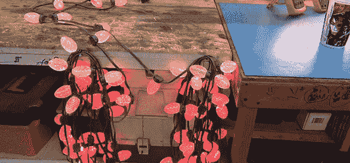

# 同步两股 G35 圣诞灯

> 原文：<https://hackaday.com/2012/12/04/syncing-two-strands-of-g35-christmas-lights/>

几年来，全世界黑客和制造商最想要的圣诞灯是 GE G35 变色灯。通过微控制器控制的 50 个单独的 RGB LEDs，这些灯串可以在像 Arduino 这样简单的东西的帮助下显示任何模式的灯。股票轻序列有点问题，特别是如果你运行多个字符串。

[Todd]拿起两根 G35 线，即使它们同时打开，大约半小时后灯光序列也会慢慢失去同步。他想出了一个很好的方法来确保这些灯保持同步，只需要一点小小的改动。要使两个灯串保持同步，只需将数据线从一个灯串的控制器上断开，并将该连接与另一个灯串桥接即可。

这是一个非常容易的修改，但它不会给你两倍的单独可控的 LED-为此，你必须使用多个 Arduinos 或购买更长的 RGB LED 灯条。尽管如此，拥有两个相同的 7×7 LED 面板比拥有一个面板要好，所以我们不得不为此向托德致敬。