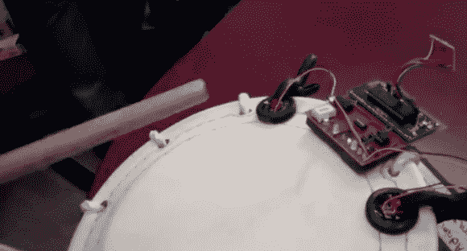

# 日本鼓手老师

> 原文：<https://hackaday.com/2012/12/04/japanese-drumming-sensei/>

如果你想学习打日本鼓或太鼓的艺术，这个由[康奈尔大学]学生作为学校项目完成的技巧可能是一个非常有用的帮助。项目报告给人留下了非常深刻的印象，包括对他们工作的详细解释、源代码和材料清单，如果你想复制这个设备的话。

tutor 设备能够使用连接到 ATmega1284P 微控制器的压电传感器来区分软击中、硬击中和边缘击中。然后，可以使用红外发射器将这些数据传输到“随动”滚筒。这些节拍可以在几种模式下使用，包括:跟随领导者，节拍器，跟我重复，和鼓战斗模式。

好吧，也许没有鼓战模式，但一定要在休息后看看太鼓教具的演示。有很多关于构建的细节，但他们在 4 点左右开始一些校准鼓声，如果你想看看它的运行。

[https://www.youtube.com/embed/4nIfARNWDEE?version=3&rel=1&showsearch=0&showinfo=1&iv_load_policy=1&fs=1&hl=en-US&autohide=2&wmode=transparent](https://www.youtube.com/embed/4nIfARNWDEE?version=3&rel=1&showsearch=0&showinfo=1&iv_load_policy=1&fs=1&hl=en-US&autohide=2&wmode=transparent)