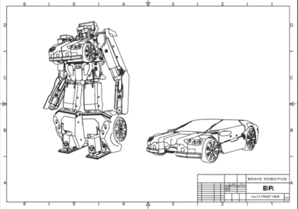

# 遥控汽车变身遥控机器人

> 原文：<https://hackaday.com/2012/12/05/rc-car-transforms-into-rc-robot/>

《变形金刚》第一集播出近 30 年后，终于有人做到了。日本一家名为 Brave Robotics 的公司[创造了一个真正的变形机器人](http://www.youtube.com/watch?v=iAvG0buqa2Q#!)，它是半遥控汽车半遥控两足机器人。

据勇敢机器人公司的网站称，这项发明是 10 多年来的成果。2002 年，变形机器人的第一个版本完成了——这是一件相对简单的事情，可以变形，但不能行走或驾驶。在过去的 10 年里，原型已经有了逐步的改进，包括车轮的驱动系统，转向机构，甚至移动手臂和发射塑料飞镖的能力。

令人惊讶的是，你可以花 1，980，000 日元(约合 24，000 美元)买到一台 Brave Robotics 的变形机器人。有点贵，但我们相信未来会看到更多变形机器人。

休息之后，再来看几个勇敢机器人改造机器人的视频。

[https://www.youtube.com/embed/iAvG0buqa2Q?version=3&rel=1&showsearch=0&showinfo=1&iv_load_policy=1&fs=1&hl=en-US&autohide=2&wmode=transparent](https://www.youtube.com/embed/iAvG0buqa2Q?version=3&rel=1&showsearch=0&showinfo=1&iv_load_policy=1&fs=1&hl=en-US&autohide=2&wmode=transparent) [https://www.youtube.com/embed/zzYosHcyCrI?version=3&rel=1&showsearch=0&showinfo=1&iv_load_policy=1&fs=1&hl=en-US&autohide=2&wmode=transparent](https://www.youtube.com/embed/zzYosHcyCrI?version=3&rel=1&showsearch=0&showinfo=1&iv_load_policy=1&fs=1&hl=en-US&autohide=2&wmode=transparent)