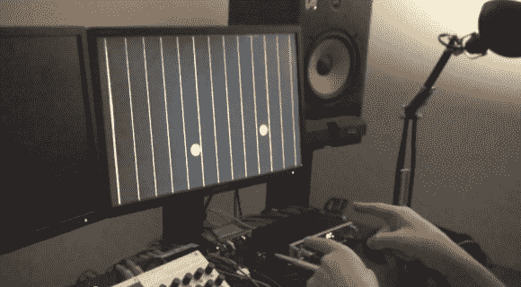

# 使用跳跃动作的空气竖琴

> 原文：<https://hackaday.com/2012/12/05/air-harp-using-the-leap-motion/>

他只是在这个图像中指，但是这个空气竖琴可以用许多手指同时弹奏。这是[Adam Somers]在一个周末与 Leap Motion 开发人员委员会一起工作时做的演示。我们第一次[听说这个光滑的硬件是在 5 月](http://hackaday.com/2012/05/21/hackit-leap-motions-new-motion-sensor/)，从它的外观来看，它和最初报道的一样令人惊讶。

让这个项目如此迅速地走到一起的部分原因是[Adam]已经开发了一个叫做 muskit 的包。这是一个制作音乐应用程序的 C++工具包。它为我们在休息后的视频中听到的内容建立了框架。黑客的周末利用来自 Leap Motion 的位置数据，处理你的手指如何与虚拟字符串交互。你可以看到[亚当]给虚拟乐器添加越来越多的弦，让他的手指与之互动。离屏幕的距离决定了你的手指是否会拨动。当您的指尖足够靠近以与幻像弦互动时，这用红色圆圈表示。

从[他的仓库](https://github.com/AdamSomers/airharp)中获取代码。

[https://www.youtube.com/embed/U2HFcfOwDtI?version=3&rel=1&showsearch=0&showinfo=1&iv_load_policy=1&fs=1&hl=en-US&autohide=2&wmode=transparent](https://www.youtube.com/embed/U2HFcfOwDtI?version=3&rel=1&showsearch=0&showinfo=1&iv_load_policy=1&fs=1&hl=en-US&autohide=2&wmode=transparent)