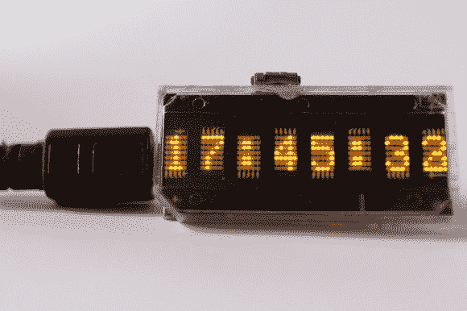

# 极客腕表的起源

> 原文：<https://hackaday.com/2012/12/05/the-beginnings-of-a-geeky-wristwatch/>

哇，我们今天看到了纽约电阻器的各种好东西。[Caleb]发现这与[Hudson]早期在一款古怪手表上的工作有关。它基于 HDSP-2112 八位字母数字显示器。每个数字是一个 5×7 的发光二极管阵列，但它的外观真的让我们想起了[【沃兹】谢妮手表](http://hackaday.com/2009/11/03/wozs-watch-makes-air-travelers-nervous/)。使用像这样的显示器的好处是它更容易驾驶，而且功率要求也不需要特别考虑。

该显示器恰好与 Teensy 2.0 几乎相同。事实上，显示屏有点长。这使它成为一个完美的背包，带来一切必要的驱动显示。休息后看看视频，它会以文字形式滚动时间，并显示数字。

这需要有一个 RTC 和便携式电源，然后才能戴在身上。但是证据就在那里。或许[Hudson]会用一个包括 RTC 功能和微型锂电池充电电路的 uC 来旋转他自己的板。

[https://embedr.flickr.com/photos/8196544063](https://embedr.flickr.com/photos/8196544063)