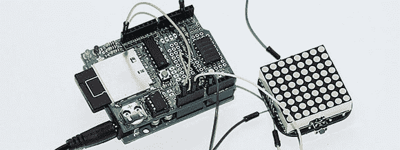

# 电压记录器以正确的方式工作

> 原文：<https://hackaday.com/2012/12/06/voltage-logger-does-it-the-right-way/>

Adafruit 的人已经忙着设计 LED 矩阵手表有一段时间了。电路工作良好，但由于这款手表由硬币电池供电，他们真的希望功耗尽可能低。这意味着他们需要一个测试平台来测量每个固件版本的功耗，但是如何构建一个电压记录器来处理这么小的电压和电流呢？[这是一个非常有趣的项目](http://learn.adafruit.com/low-power-coin-cell-voltage-logger/overview)，提供了大量关于如何为非常小的项目构建精确电压记录器的信息。

Adafruit 的 TIMESQUARE 手表是一个小电路板，带有 ATMega328p 微控制器和 8×8 红色 LED 矩阵，由单个硬币电池供电。为了测试固件的每个版本，Adafruit 的人员拿出了他们的 Arduino 数据记录屏蔽，每分钟按一下手表的按钮(激活显示器)并测量电池的电压。

记录手表电压的简单方法是使用数据记录屏蔽上的数字引脚激活手表，然后用模拟输入引脚读取电压。不过，这不会正确工作:手表上的微控制器非常擅长从任何地方获得所需的电力，直接将其连接到 Arduino 会扭曲结果。

替代解决方案是使用光隔离器，但令人惊讶的是，Adafrtuit 实验室没有任何库存。不过，还有另一种不用电源就能启动手表上按钮的方法:三态逻辑。

数据记录屏蔽不是向连接到手表按钮的引脚发送 5 伏电压，而是在输入和输出之间交替。当屏蔽上的数字引脚是输入时，手表看到的是开路。当数字引脚变为输出时，电流从手表流向地，就像完全没有数据记录屏蔽一样。

这是一个巧妙的技巧，对于那些目光呆滞的人来说。“三态输出”和“高阻抗状态”，这是对比用 Arduino 闪烁 LED 稍微复杂一点的东西的完美介绍。