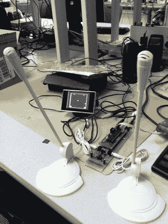

# 声控视频游戏使用“Biu”和“ahh”进行控制

> 原文：<https://hackaday.com/2012/12/06/voice-controlled-video-game-uses-biu-and-ahh-for-control/>

这个视频游戏让你的拇指在拉伸声带的同时得到休息。上面看到的一对[麦克风控制着液晶显示器](http://people.ece.cornell.edu/land/courses/ece4760/FinalProjects/f2012/tg293/tg293/index.html)上的视频游戏。说“Biu”会发射弹丸，而“ahh”会调整飞行轨迹。该系统是由[高天]开发的，作为他在康乃尔大学 ECE 4760 课程的最终项目。

输入是普通的计算机麦克风，连接到他在一块原型板上构建的一些处理电路。这包括一些 RC 滤波和一个 LM358 运算放大器，使信号准备好与 ATmega1284 一起使用。该芯片上只有一个 ADC，因此[Tian]利用芯片内置的多路复用器交替采样麦克风。视频信号本身是 NTSC 复合信号。为了获得合理的帧速率，他使用了打包成 8 位倍数的图形。总之，这使他能够创建一个 160×200 像素的显示器。

所有这些都让这个游戏听起来有点枯燥，但我们敢说你在休息后听视频剪辑时不会笑。

[https://www.youtube.com/embed/_A6a-nzFfZM?version=3&rel=1&showsearch=0&showinfo=1&iv_load_policy=1&fs=1&hl=en-US&autohide=2&wmode=transparent](https://www.youtube.com/embed/_A6a-nzFfZM?version=3&rel=1&showsearch=0&showinfo=1&iv_load_policy=1&fs=1&hl=en-US&autohide=2&wmode=transparent)